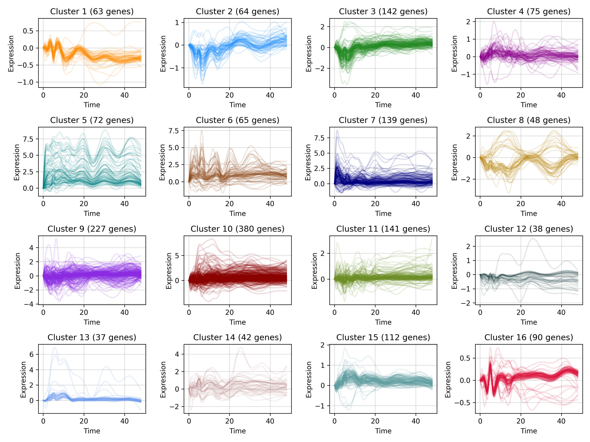
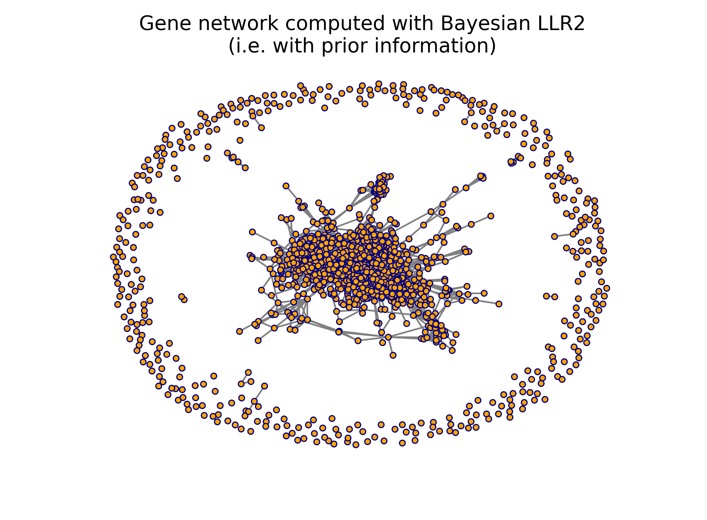
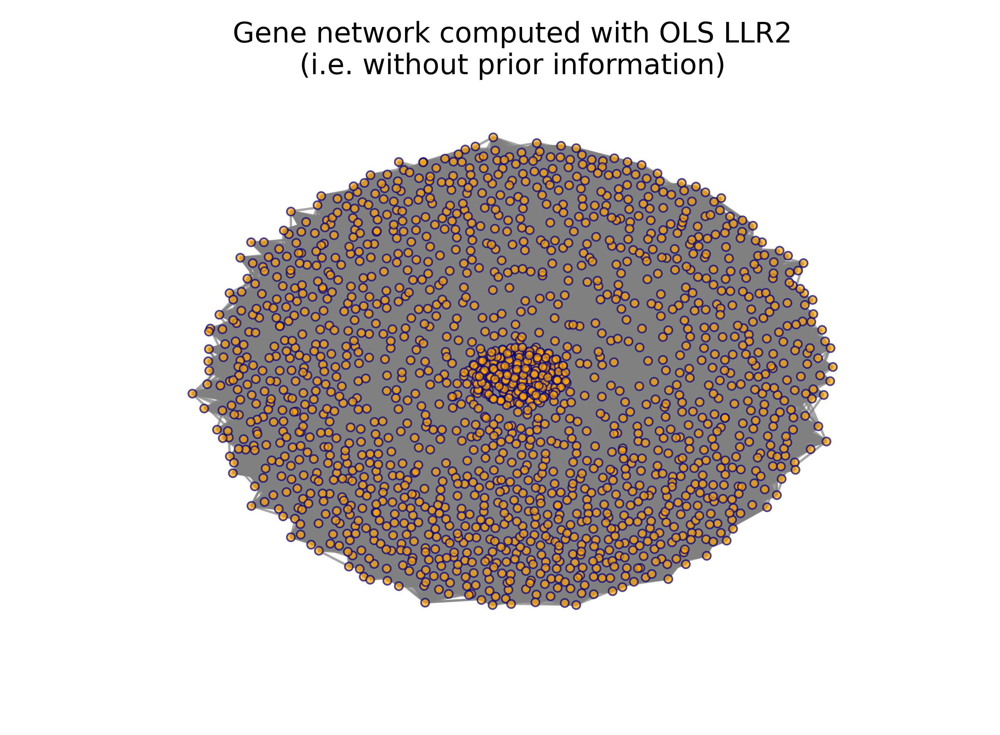

## Dynamic models of co-regulated gene expression (Python)

This repository provides a Python implementation of the Bayesian lead-lag $R^2$ (LLR2) algorithm introduced in [Venkatraman et al. (2021)](https://www.tandfonline.com/doi/abs/10.1080/26941899.2023.2219707) for biologically-informed clustering and network analysis of time-course gene expression data. The R implementation is [here](https://github.com/sara-venkatraman/Bayesian-Gene-Dynamics).

The algorithm makes use of the `NumPy` and `SciPy` packages, as well as `Matplotlib` and `NetworkX` for data visualization.

### Explanation of clustering algorithm

The objective of the LLR2 algorithm is to cluster genes into groups that exhibit similar expression patterns over time. To do this, we measure the similarity between each pair of genes using the lead-lag $R^2$ metric (derived in full in Section 3 of our paper), which is computed using Bayesian regression.


#### 1. Choice of similarity metric

The similarity metric is computed as follows. We assume the expression of a single gene $A$ over time is given by the differential equation

$$\frac{\text{d}m_A(t)}{\text{d}t} = p(t) - \kappa_A m_A(t),$$ 

where $p(t)$ is a regulatory signal that may be common to multiple genes and $\kappa_A$ is a degradation rate. Assuming a second gene $B$ is similarly governed by $\frac{\text{d}m_B(t)}{\text{d}t} = p(t) - \kappa_B m_B(t)$, we can substitute this equation for gene $B$ into that of gene $A$ and integrate through to obtain the following model:

$$m_A(t) = c_1 m_B(t) + c_2\int_0^t m_B(s)\text{d}s + c_3\int_0^t m_A(s)\text{d}s + c_4 t + c_5$$

which is linear in the (unknown) constants $c_1,...,c_5$, the precise definitions of which can be found in equation 4 of Section 2.1 in our paper. 

Thus, given temporal measurements $\{m_A(t_1),...,m_A(t_n)\}$ and $\{m_B(t_1),...,m_B(t_n)\}$ of genes $A$ and $B$, respectively, we can fit this model using linear regression - i.e., solve for the coefficients $c_1$ through $c_5$. 

The $R^2$ from this model, which we refer to as the lead-lag $R^2$ (LLR2), is our measure of "similarity" between genes $A$ and $B$.


#### 2. Use of Bayesian regression in similarity calculation

The auxiliary function `computeLLR2Bayes` in the file `llr2.py` uses Bayesian regression to compute the above-mentioned lead-lag $R^2$ between a pair of genes, given the time series data for both. Specifically, it uses external information from prior genomic studies or biological databases to place informative priors on the vector of coefficients $\boldsymbol{\beta} = [c_1,...,c_5]$; this helps to avoid obtaining spuriously high LLR2 values between genes. Regression settings are detailed in Section 3.1 to 3.4 of our paper.

Our full algorithm, which computes the LLR2 between all pairs of genes and stores the values in a matrix, is implemented in the main function `LLR2` in the file `llr2.py`. As input, it takes a list of all $N$ genes' temporal expression profiles and a $N\times N$ prior "adjacency" matrix, each entry of which is 1, 0, or NA to indicate whether an association between the corresponding two genes exists (1), is unlikely (0), or is unknown (NA).


#### 3. Clustering

We can use the LLR2 matrix produced by the `LLR2` function as a similarity matrix in a hierarchical clustering method to divide the set of genes into groups that exhibit similar temporal dynamics and are likely to be biologically associated with one another. 


### Usage

Below is an abridged example of how to use this software, taken from the file `results.py`.

First, we read our $N \times n$ gene expression dataset, containing measurements of $N$ genes across $n$ timepoints, and $N \times N$ matrix of prior information. Examples of these are in the `Data` directory. We also define the hours corresponding to the $n$ timepoints.

```
# Read gene expression data and prior adjacency matrix
geneData = pd.read_csv("Data/geneData.csv", index_col = 0)
priorMatrix = pd.read_csv("Data/priorMatrix.csv", index_col = 0)

# Save gene names and define hours corresponding to each time point
geneNames = geneData.index
hours = [0, 1, 2, 4, 5, 6, 8, 10, 12, 14, 16, 20, 24, 30, 36, 42, 48]

# Reshape gene expression data into a list of lists
geneData = geneData.values.tolist()
```

Next, we run the `LLR2` algorithm. This returns the $N \times N$ similarity matrix `LLR2Bayes`, which we can use for  clustering.

```
LLR2Bayes = LLR2(geneData, hours, bayes = True, priorMatrix = priorMatrix, writeToCSV = True)
```

We now run the standard hierarchical clustering function from `SciPy`, first converting our similarities into distances, and then we divide the genes into 16 clusters.

```
# Perform clustering on condensed distance matrix
hierClust = linkage(squareform(1 - LLR2Bayes), method = "ward")

# Divide genes into clusters
subGroups = fcluster(hierClust, t = 16, criterion = "maxclust")
(clusterNumber, clusterCounts) = np.unique(subGroups, return_counts = True)
```

We now plot the temporal expression patterns of the genes in the 16 clusters and can see that there are several groups with visually similar trajectories.

```
# Define plot colors for each cluster
plotColors = ["darkorange", "dodgerblue", "forestgreen", "darkmagenta", "teal", "saddlebrown", "navy", "darkgoldenrod", "blueviolet", "darkred", "olivedrab", "darkslategray", "cornflowerblue", "rosybrown", "cadetblue", "crimson"]

# Set up plot window with 16 subplots
fig, axes = plt.subplots(4, 4, figsize = (12, 9))

# Plot genes in each cluster
for i, ax in enumerate(axes.flatten()):
  # Extract gene time series data for current cluster i
  genesInCluster = np.where(subGroups == (i + 1))[0]
  clusterData = [geneDataList[i] for i in genesInCluster]
  
  # Set plot title
  plotTitle = "Cluster " + str(i + 1) + " (" + str(clusterCounts[i]) + " genes)"
  
  # Draw plot
  fig = plotGenes(clusterData, hours, plotColors = [plotColors[i]] * len(genesInCluster), lineOpacity = 0.15, axis = ax, xAxisLabel = "Time", yAxisLabel = "Expression", plotTitle = plotTitle)

# Display plot
plt.tight_layout()
plt.show()
```



We can also visualize the associations found between temporal patterns as a network. Below, we draw a network of the genes in this dataset by representing each gene as a node, and drawing an edge between two genes if their LLR2 value exceeds 0.9.

```
# Create adjacency matrix by thresholding R^2 values at 0.9
adjacencyBayes = (LLR2Bayes > 0.9) + 0

# Zero out diagonal to avoid self-loops and construct graph
np.fill_diagonal(adjacencyBayes, 0)
graphBayes = nx.from_numpy_array(adjacencyBayes)

# Draw network figure
plt.figure(figsize = (5, 5))
plt.title("Gene network computed with Bayesian LLR2")
nx.draw(graphBayes, nx.spring_layout(graphBayes, k = 0.05, seed = 123), with_labels = False, node_size = 12, edgecolors = "navy", edge_color = "gray", linewidths = 1, node_color = "orange")
plt.show()
```

The advantage of our Bayesian regression method is that it makes use of prior information to filter out unlikely and/or spurious associations between genes. The ``LLR2`` function also allows the user to compute the lead-lag $R^2$ metric using ordinary least squares regression, i.e. without prior information. Below, we compute the LLR2 matrix in this manner and show the two network diagrams (i.e. with and without Bayesian regression) side-by-side for comparison; the network computed from the OLS-based LLR2 metric is much more dense.

```
# Run the LLR2 algorithm without Bayesian regression (i.e., using OLS regression)
LLR2OLS = LLR2(geneDataList, hours, bayes = False, writeToCSV = True)

# Create adjacency matrix by thresholding R^2 values at 0.9
adjacencyOLS = (LLR2OLS > 0.9) + 0

# Zero out diagonal to avoid self-loops and construct graph
np.fill_diagonal(adjacencyOLS, 0)
graphOLS = nx.from_numpy_array(adjacencyOLS)

# Draw network figure
plt.figure(figsize = (5, 4))
plt.title("Gene network computed with OLS LLR2")
nx.draw(graphOLS, nx.spring_layout(graphOLS, k = 0.25, seed = 123), with_labels = False, node_size = 12, edgecolors = "navy", edge_color = "gray", linewidths = 0.7, node_color = "orange", alpha = 0.7)
plt.show()
```

<p float = "left">
  
   
</p>
